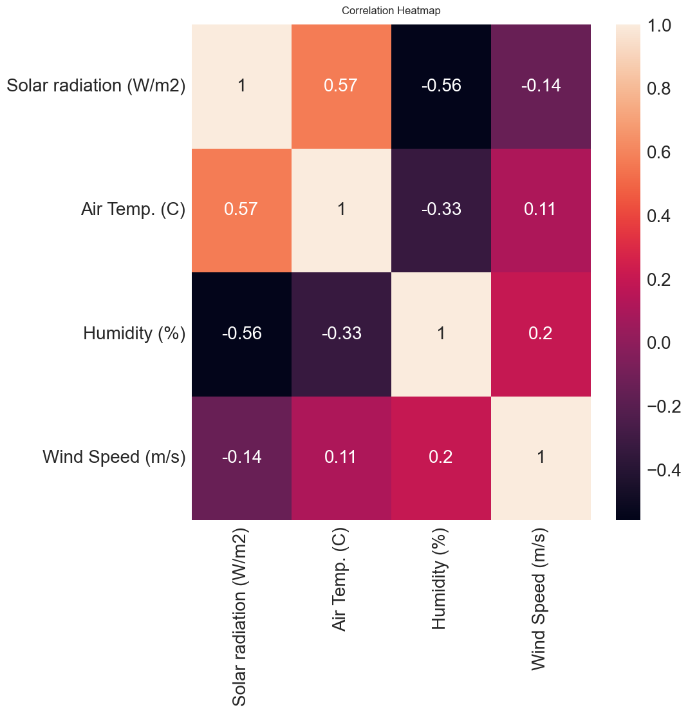

## Modelling a bridge temperature with <ins>machine mearning algorithms</ins>
Project abstract: Lately, there has been a growing interest in the utilization of statistical methodologies and artificial intelligence (AI) approaches such as machine learning and deep learning, particularly within the realm of engineering. These data-driven techniques have become increasingly important for achieving faster and more precise predictions. In this research, we applied machine learning methods to actual engineering data with the objective of constructing a robust model for forecasting bridge deck surface temperature and outlet temperature. To achieve this, we leveraged meteorological data gathered during a bridge de-icing project in Texas. Our analysis encompassed the use of
* Random Forest,
* XGBoost,
* K-Nearest Neighbors (KNN),
* Multiple Linear Regression (MLR), and
* Support Vector Regression (SVR).

We then compared and authenticated the forecasted results against available field data. Random Forest, XGBoost, and KNN algorithms exhibited high accuracy in predicting the average surface temperature and the outlet temperature with R2= 0.98-0.99. The results are presented in conferences below:
* IEEE International Conference on Artificial Intelligence, Blockchain, and Internet of Things (Sept. 2023), Central Michigan University, USA.
* IEEE Symposium Sensor Data Fusion and International Conference on Multisensor Fusion and Integration (Nov. 2023), Bonn, Germany.

Contributors:

* Faezeh Soleimani
* Saeed Bidi
* Omid Habibzadeh-Bigdarvish 
* Xinbao Yu

To access the python code, please cotact: saeed.bidi@city.ac.uk

## Results summary

    

    

    

    

    

    

    

    

    

    

    

    

    

